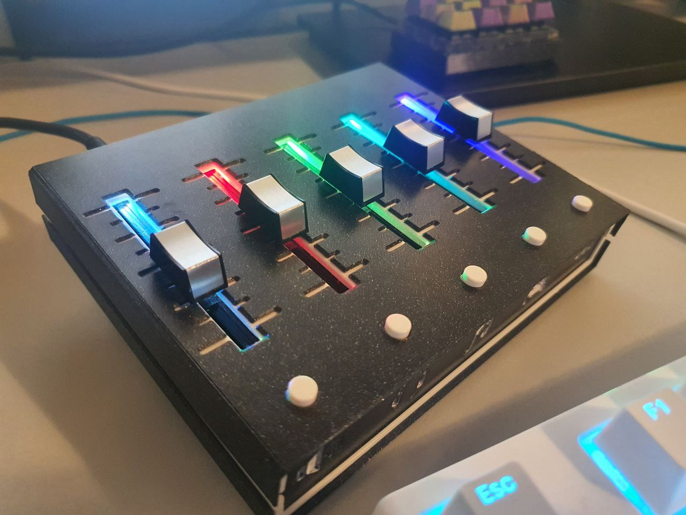

# Deej Audio Fader

This is the modified Arduino code to my deej audio fader. 
Nothing special, just some lighting for now. 

For the deej project, see: https://github.com/omriharel/deej

Demo Video:
https://youtu.be/xecxh_4L5Vo

Features:
- 5 Audio Sliders
- RGB-Lighting with color mixing
- Simple signal smoothing 
